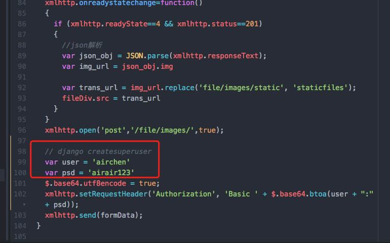

# somesiteOpen

## Required
Django (1.11.5)
django-bootstrap3 (9.0.0)
djangorestframework (3.6.4)
easy-thumbnails (2.3)
matplotlib (2.0.2)
numpy (1.13.3)
Pillow (4.2.1)
scipy (0.19.1)
six (1.11.0)

## Run the project
Step 1:clone the project

```
 git clone <urls>
```

Step 2:setup basic enviroment

```
 pip install <Required>
```

Step 3:inital django

```
 python manage.py makemigrations fileApp

 python manage.py migrate

 python manage.py createsuperuser

 python manage.py runserver 0.0.0.0:8001
```

## WARNING

1.if you can't trans your picture to the site, maybe you should instand the superuser in /static/fileApp/js/page.js.



2.the image processing part is in other [repositorie](https://github.com/AirChen/imgProcess).
